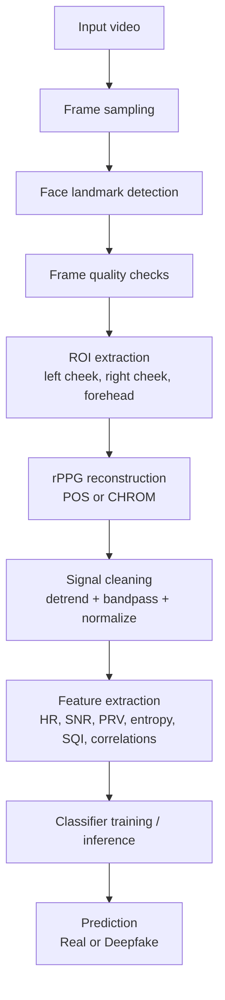

# rPPG Pipeline for Low-Resolution KYC Deepfake Detection

An end-to-end remote photoplethysmography (rPPG) system for detecting deepfake video in low-resolution KYC-style footage.

The project is organized as a two-stage pipeline:

1. Extract physiological liveness evidence from video frames.
2. Train a lightweight classifier on those rPPG features to predict real vs deepfake.

The implementation uses landmark-based facial regions of interest, POS/CHROM pulse reconstruction, signal cleaning, and a feature-based classifier instead of a naive green-channel baseline.

> **Downstream integration**: `dataset_features.csv` is the direct data source for the quantum decision layer
> (`WORKING/quantum/`): it consumes the 8 rPPG features as-is (no synthetic data), flips the label convention
> (CSV 1 = fake -> quantum 0 = fake), and builds its training/eval splits from this table.

## Architecture



## Repository Layout

```text
.
├── README.md
├── requirements.txt
├── archive/
│   └── DFDC_Dataset/
│       ├── Fake/
│       └── Real/
├── dataset_features.csv
├── rppg/
│   ├── face_roi.py
│   ├── preprocessing.py
│   ├── signal_extraction.py
│   ├── features.py
│   └── pipeline.py
└── rppg-pipeline/
    ├── _check_video.py
    ├── _make_test_video.py
    ├── batch_run.py
    ├── debug_run.py
    ├── extract_dataset_features.py
    ├── run_live_webcam.py
    ├── run_on_video.py
    ├── streamlit_app.py
    └── train_classifier.py
```

## What The Pipeline Does

The rPPG pipeline turns each video into a compact physiological feature vector:

- Heart rate in BPM
- Signal-to-noise ratio in dB
- Pulse rate variability in ms
- Spectral entropy
- Mean absolute deviation
- Signal quality index
- Cheek-to-forehead correlation
- Left-to-right cheek correlation

Those features are then used by a classifier to estimate whether the video is likely real or deepfake.

## Data Sources

The current training workflow supports the new dataset layout:

- `archive/DFDC_Dataset/Fake`
- `archive/DFDC_Dataset/Real`

The extractor also keeps compatibility with the older `archive (1)` CSV-based dataset if it exists.

## Installation

```bash
pip install -r requirements.txt
```

## First-Run Face Model

This project uses MediaPipe's Face Landmarker Tasks API. On first run it may download a small model file automatically and cache it locally.

If the machine has no internet access, place the model manually or provide a custom path through `FaceROIExtractor`.

## Quick Start

### 1. Extract rPPG features

```bash
python rppg-pipeline/extract_dataset_features.py
```

Useful options:

- `--method POS` or `--method CHROM`
- `--target-fps 15`
- `--max-per-class 50` for a faster smoke test

This writes `dataset_features.csv` at the repository root.

### 2. Train the classifier

```bash
python rppg-pipeline/train_classifier.py
```

This saves:

- `rppg_classifier.pkl`
- `rppg_classifier_metadata.json`

### 3. Run the demo app

```bash
python -m streamlit run rppg-pipeline/streamlit_app.py
```

The app opens a web UI where you can upload a video and get a real/deepfake prediction.

## Command-Line Usage

### Analyze a single video

```bash
python rppg-pipeline/run_on_video.py path/to/video.mp4 --method POS --plot
```

### Run batch processing

```bash
python rppg-pipeline/batch_run.py
```

### Test the webcam path

```bash
python rppg-pipeline/run_live_webcam.py
```

## Model Training Notes

The trainer uses a stronger baseline than the original version:

- median imputation for missing values
- class-balanced RandomForest
- stratified train/test split when possible
- cross-validated balanced accuracy when there are enough samples

This is intentionally simple and interpretable so that feature quality, not model complexity, remains the main signal.

## Why This Design Works

- Landmark-based facial ROIs are more stable than bounding boxes, especially when faces are small in frame.
- POS and CHROM are more robust than a raw RGB average under motion and compression artifacts.
- Physiological correlations across cheeks and forehead help distinguish real biological signal from synthetic face generation.
- The pipeline returns `features=None` when a clip is too weak to trust, which avoids forcing a bad prediction.

## Validation Strategy

Before using the pipeline as a research result, validate the rPPG stage on ground-truth datasets such as:

- UBFC-rPPG: https://sites.google.com/view/ybenezeth/ubfcrppg
- PURE: https://www.tu-ilmenau.de/en/university/departments/department-of-computer-science-and-automation/profile/institutes-and-groups/institute-for-computer-and-systems-engineering/group-for-neuroinformatics-and-cognitive-robotics/data-sets-code/pulse-rate-detection-dataset-pure

Measure heart-rate error against the provided contact-PPG reference and report MAE/RMSE before relying on the classifier for conclusions.

## Limitations

- Strong occlusion, masks, or very poor lighting can produce unreliable features.
- Very low frame rates reduce the usable heart-rate range.
- Heavy compression can distort skin-tone cues and weaken rPPG extraction.
- The classifier is only as good as the extracted features and training data quality.

## Output Files

- `dataset_features.csv` - extracted feature table
- `rppg_classifier.pkl` - trained model
- `rppg_classifier_metadata.json` - training summary and column metadata

## Recommended Workflow

1. Add new videos to `archive/DFDC_Dataset/Fake` and `archive/DFDC_Dataset/Real`.
2. Regenerate features with `extract_dataset_features.py`.
3. Retrain the classifier with `train_classifier.py`.
4. Launch the Streamlit app and test predictions on unseen videos.

## Project Goal

The goal of this repository is not just to classify videos, but to expose a reproducible physiological signal pipeline that is easy to inspect, train, and extend for low-resolution deepfake detection.
