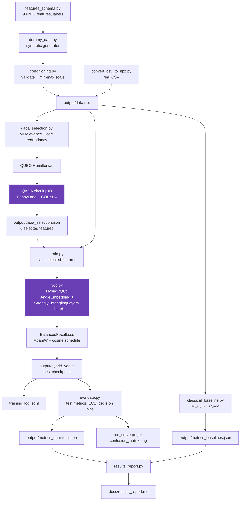

# Quantum ML Component — DeepFake Detection via rPPG Features

Version: 0.1.0

A hybrid quantum-classical machine learning pipeline for deepfake video detection. The
component classifies video samples as **real** or **fake** based on 9 quality features
extracted from remote photoplethysmography (rPPG) pulse signals — the biological signal
recovered from subtle skin-color changes across facial regions.

Deepfake videos typically corrupt the natural pulse waveform. The features in this
pipeline quantify temporal consistency, rhythm quality, inter-region agreement and
related signal properties; a **hybrid Variational Quantum Classifier (VQC)** learns to
separate real from fake, guided by a **QAOA**-based feature selection step that
automatically picks the most relevant, least redundant subset of features.

> **Note:** The current dataset is synthetic placeholder data. Swap in the real rPPG
> feature CSV (see `convert_csv_to_npz.py` and `docs/interface_contract.md`) and rerun
> the pipeline.

---

## Table of Contents

- [Architecture Overview](#architecture-overview)
- [Quantum Components](#quantum-components)
  - [QAOA Feature Selection](#1-qaoa-feature-selection)
  - [Hybrid Variational Quantum Classifier](#2-hybrid-variational-quantum-classifier-vqc)
  - [Loss Function](#3-balanced-focal-loss)
- [File Reference](#file-reference)
- [Entire Workflow](#entire-workflow)
- [Workflow Diagram](#workflow-diagram)
- [Running the Pipeline](#running-the-pipeline)
- [Output Artifacts](#output-artifacts)

---

## Architecture Overview

The pipeline is a 6-stage orchestrated flow controlled by `run_quantum.py`:

```
data → QAOA feature selection → hybrid VQC training → evaluation → classical baselines → report
```

Two quantum algorithms are used:

| Algorithm                                                   | Purpose                                               | Where                     |
| ----------------------------------------------------------- | ----------------------------------------------------- | ------------------------- |
| **QAOA** (Quantum Approximate Optimization Algorithm) | Selects the 6 most relevant, least redundant features | `qaoa_selection.py`     |
| **VQC** (Variational Quantum Classifier)              | Classifies real vs. fake from the selected features   | `vqc.py` + `train.py` |

Both run on the `lightning.qubit` simulator via **PennyLane**, with Torch as the
differentiation/training framework (adjoint diff method for the QNode).

### Hardware Acceleration

- **CUDA classical head (automatic):** if a CUDA-capable GPU is available, the classical
  head of the `HybridVQC` runs on GPU and batched data is moved to it. The PennyLane
  quantum block stays on CPU (the `lightning.qubit` simulator does not accept CUDA
  tensors). Everything falls back to CPU automatically when no GPU is present.
- **GPU quantum simulator (automatic, where supported):** the quantum device is resolved
  at runtime by `resolve_device()` in `config.py` — it uses `lightning.gpu` when
  `pennylane-lightning-gpu` is installed (Linux/WSL only), otherwise `lightning.qubit`.
  No code changes needed to switch.
- **Note:** `pennylane-lightning-gpu` ships Linux-only wheels; it cannot be installed on
  native Windows.

---

## Quantum Components

### 1. QAOA Feature Selection

Feature selection is formulated as a **quadratic unconstrained binary optimization
(QUBO)** problem over a binary vector `z ∈ {0,1}^n` where `z_i = 1` means "feature i is
selected".

**Objective:**

```
cost(z) = -w·z + λ/2 · zᵀCz - λ/2 · zᵀz + μ · (Σz - k)²
```

- `w`: normalized **mutual information** between each feature and the label (relevance)
- `C`: absolute **correlation matrix** between features (redundancy penalty)
- `λ` = 0.3 (redundancy penalty), `μ` = 0.5 (cardinality penalty), `k` = 6 (target count)

The QUBO is converted into a **spin Hamiltonian** (Pauli `Z` and `ZZ` operators plus a
classical constant offset), so minimizing the Hamiltonian expectation equals minimizing
the classical cost — verified numerically by `verify_hamiltonian()`.

A **p = 3 QAOA circuit** is executed:

1. All qubits initialized in superposition with Hadamard gates
2. Alternating cost layers (`PauliRot` with angle `2γᵢ·coeff`) and mixer layers (`RX`)
3. The parameters `(γ, β)` are optimized classically with **COBYLA**
4. The final state is sampled; the most probable bitstring identifies the feature subset
5. A greedy adjustment enforces exactly `k = 6` selected features

**Output:** `output/qaoa_selection.json` — selected indices, feature names, marginal
probabilities, optimized energy, and Hamiltonian metadata.

### 2. Hybrid Variational Quantum Classifier (VQC)

The classifier is a hybrid neural network where a trainable quantum circuit replaces the
feature encoder:

```
selected features (6)
      │  angle embedding (Y rotations)
      ▼
┌─────────────────────────────┐
│  QuantumFeatureBlock        │
│  AngleEmbedding(Y)          │
│  StronglyEntanglingLayers   │
│  (3 layers, 3 params/qubit) │
│  → 6 Pauli-Z expvals        │
└─────────────────────────────┘
      ▼
classical head: Linear(6→8) → ReLU → Dropout(0.2) → Linear(8→1)
      ▼
                          logit → sigmoid → probability of REAL
```

- **Encoding:** each selected feature is rotated onto a qubit via `AngleEmbedding`
- **Circuit:** `StronglyEntanglingLayers` (3 layers, 6 qubits, 3 rotation parameters per
  qubit per layer = 54 trainable parameters)
- **Readout:** expectation value of `PauliZ` on every qubit
- **Differentiation:** adjoint method, Torch interface via `qml.qnn.TorchLayer`
- **Training:** AdamW + CosineAnnealingLR for 40 epochs, batch size 32; the best
  validation-accuracy checkpoint is persisted

### 3. Balanced Focal Loss

`BalancedFocalLoss` combines four mechanisms for robust learning on imbalanced,
hard-to-classify data:

- **Focal loss** (γ = 2.0): down-weights easy samples, focuses on hard/misclassified ones
- **Class balancing** (α = 0.75): weights the positive (real) class
- **Label smoothing** (0.1): prevents overconfidence
- **Confidence penalty** (0.3): an additional quadratic penalty on confident-but-wrong predictions

---

## File Reference

### Configuration & Contracts

| File                   | Description                                                                                                                                                                     |
| ---------------------- | ------------------------------------------------------------------------------------------------------------------------------------------------------------------------------- |
| `config.py`          | Frozen dataclasses for every stage:`DataConfig`, `QAOASelectionConfig`, `VQCConfig`, `DecisionConfig`. Central place for hyperparameters, thresholds, and output paths. |
| `features_schema.py` | The data contract: 9 rPPG feature names, real/fake label encoding, per-feature meanings, and a`FeatureContract` dataclass. Single source of truth for column order.           |
| `conditioning.py`    | Feature matrix validation (2D, 9 columns, finite, [0,1] range) and min-max normalization via`FeatureConditioner`. Persists/loads to/from `output/scaler.json`.              |
| `__init__.py`        | Package marker; defines`__version__`.                                                                                                                                         |

### Data Layer

| File                      | Description                                                                                                                                                                                                                                                   |
| ------------------------- | ------------------------------------------------------------------------------------------------------------------------------------------------------------------------------------------------------------------------------------------------------------- |
| `dummy_data.py`         | Synthetic data generator: real samples drawn from a high latent (mean 0.7), fakes from a low latent (mean 0.3), with class-appropriate noise. Produces`output/data.npz`, `output/features.csv`, `output/scaler.json`. Also provides `load_dataset()`. |
| `convert_csv_to_npz.py` | Bridge for real data: validates a CSV (`split,label,<9 features>`) against the schema and converts it to the pipeline's NPZ format. CLI: `--csv <file>`.                                                                                                  |

### Quantum Modules

| File                  | Description                                                                                                                                                                                                                         |
| --------------------- | ----------------------------------------------------------------------------------------------------------------------------------------------------------------------------------------------------------------------------------- |
| `qaoa_selection.py` | QAOA feature selection: mutual-information scoring, correlation penalties, QUBO→Hamiltonian conversion, p=3 QAOA circuit optimization (COBYLA), marginals, target-count adjustment, and`verify_hamiltonian()` correctness check. |
| `vqc.py`            | Model definitions:`build_qnode()` (angle embedding + strongly-entangling layers), `QuantumFeatureBlock` (TorchLayer wrapper), `HybridVQC` (quantum block + classical head), and `BalancedFocalLoss`.                        |
| `train.py`          | Training loop: seeded DataLoaders, AdamW + cosine LR scheduler, per-epoch train/val metrics, best-val checkpointing to`output/hybrid_vqc.pt`, JSONL log to `output/training_log.jsonl`. Also exposes `predict_proba()`.       |

### Evaluation & Comparison

| File                      | Description                                                                                                                                                                                                                                        |
| ------------------------- | -------------------------------------------------------------------------------------------------------------------------------------------------------------------------------------------------------------------------------------------------- |
| `evaluate.py`           | Test evaluation: accuracy, precision, recall, F1, AUC-ROC, confusion matrix, Expected Calibration Error (ECE), and 3-way decision bins (real / uncertain / fake). Generates ROC and confusion-matrix plots. Writes`output/metrics_quantum.json`. |
| `classical_baseline.py` | Trains MLP, RandomForest, and RBF-SVM on all 9 features for a classical comparison. Writes`output/metrics_baselines.json`.                                                                                                                       |
| `results_report.py`     | Merges quantum and baseline metrics into a markdown report: comparison table, QAOA selection summary, confusion matrix, calibration stats, plot references. Writes`docs/results_report.md`.                                                      |

### Orchestration & Docs

| File                             | Description                                                                                                                  |
| -------------------------------- | ---------------------------------------------------------------------------------------------------------------------------- |
| `run_quantum.py`               | CLI entry point. Orchestrates all 6 pipeline stages; supports running each stage independently or all at once with`--all`. |
| `docs/interface_contract.md`   | Defines the data/schema expectations for integrating the real rPPG feature pipeline.                                         |
| `docs/qml_run_instructions.md` | Step-by-step run instructions for the quantum component.                                                                     |
| `docs/results_report.md`       | Generated report comparing the quantum model against classical baselines.                                                    |

---

## Entire Workflow

1. **Generate / load data** — `dummy_data.py` synthesizes train/val/test splits of 9 rPPG
   features (or a real CSV is converted via `convert_csv_to_npz.py`). The data is
   validated and min-max normalized (`conditioning.py`) into `output/data.npz`.
2. **QAOA feature selection** — `qaoa_selection.py` computes per-feature mutual
   information (relevance) and pairwise correlations (redundancy), builds the QUBO
   Hamiltonian, optimizes a p=3 QAOA circuit with COBYLA, and selects the 6 most
   informative, least redundant features → `output/qaoa_selection.json`.
3. **Train the hybrid VQC** — `train.py` slices the training data down to the selected
   features, then trains `HybridVQC` (`vqc.py`) — quantum embedding + entangling layers +
   classical head — with AdamW, cosine annealing, and the balanced focal loss. Best
   validation checkpoint → `output/hybrid_vqc.pt`.
4. **Evaluate the quantum model** — `evaluate.py` reloads the checkpoint, predicts on the
   test split, computes metrics (acc/F1/AUC/ECE), applies real/uncertain/fake decision
   bins, and saves metrics + ROC/confusion plots.
5. **Train classical baselines** — `classical_baseline.py` trains MLP, RandomForest, and
   SVM on the full 9-feature set for comparison.
6. **Build the report** — `results_report.py` merges quantum and baseline results into a
   comparison report → `docs/results_report.md`.

---

## Workflow Diagram



### Simplified ASCII version

```
                        ┌──────────────────────────────┐
                        │  features_schema.py (contract)│
                        └──────────────┬───────────────┘
                                       │
            ┌──────────────────────────┼──────────────────────────┐
            ▼                          ▼                          ▼
  dummy_data.py              real CSV via                  conditioning.py
  (synthetic rPPG)          convert_csv_to_npz.py        (validate + scale)
            │                          │                          │
            └────────────┬─────────────┴─────────────┬────────────┘
                         ▼                          ▼
                output/data.npz            output/scaler.json
                         │
          ┌──────────────┴───────────────┐
          ▼                              ▼
   QAOA selection                classical baselines
   (qaoa_selection.py)          (classical_baseline.py)
          │                        MLP / RF / SVM
          ▼                              │
   output/qaoa_selection.json            ▼
   (6 features)                  output/metrics_baselines.json
          │                              │
          ▼                              │
   train.py + vqc.py (hybrid VQC)        │
   ┌─ AngleEmbedding ──┐                 │
   │ Entangling layers │  PennyLane      │
   └─ classical head ──┘                 │
          │                              │
          ▼                              │
   output/hybrid_vqc.pt                  │
          │                              │
          ▼                              │
   evaluate.py (acc/F1/AUC/ECE)          │
          │                              │
          ▼                              │
   output/metrics_quantum.json ──────────┤
          │                              │
          ▼                              ▼
   results_report.py ──────► docs/results_report.md
```

---

## Running the Pipeline

```bash
# Full pipeline (all 6 stages)
python quantum/run_quantum.py --all

# Individual stages
python quantum/run_quantum.py --gen-data   # generate synthetic dataset
python quantum/run_quantum.py --select     # QAOA feature selection
python quantum/run_quantum.py --train      # train hybrid VQC
python quantum/run_quantum.py --evaluate   # evaluate quantum model
python quantum/run_quantum.py --baselines  # classical baselines
python quantum/run_quantum.py --report     # build markdown report

# Integrate real rPPG data
python quantum/convert_csv_to_npz.py --csv path/to/features.csv
```

**Dependencies:** Python 3.10+, PennyLane (with `lightning.qubit`), PyTorch, NumPy,
SciPy, scikit-learn, matplotlib. Optional: CUDA-enabled PyTorch for GPU acceleration of
the classical head; `pennylane-lightning-gpu` (Linux/WSL) for GPU-accelerated quantum
simulation.

---

## Output Artifacts

| Artifact                          | Description                                       |
| --------------------------------- | ------------------------------------------------- |
| `output/data.npz`               | Conditioned train/val/test splits + feature names |
| `output/features.csv`           | Human-readable CSV of the same data               |
| `output/scaler.json`            | Min-max conditioner parameters                    |
| `output/qaoa_selection.json`    | QAOA-selected features, marginals, energy         |
| `output/hybrid_vqc.pt`          | Best-checkpoint hybrid VQC weights + metadata     |
| `output/training_log.jsonl`     | Per-epoch training records                        |
| `output/metrics_quantum.json`   | Quantum test metrics                              |
| `output/metrics_baselines.json` | Classical baseline metrics                        |
| `output/roc_curve.png`          | ROC curve (quantum model)                         |
| `output/confusion_matrix.png`   | Confusion matrix (quantum model)                  |
| `docs/results_report.md`        | Generated comparison report                       |
